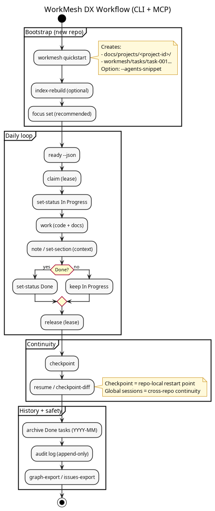
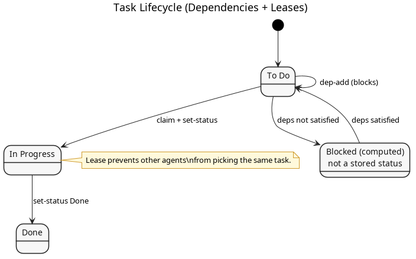
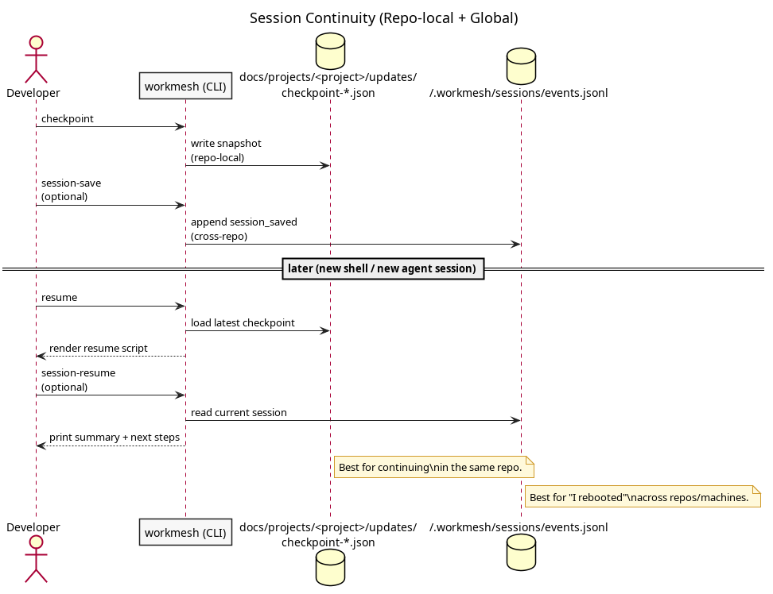

# WorkMesh

WorkMesh is a docs-first, MCP-ready project and task system that keeps work in plain text,
versioned alongside your code. It is designed for human+agent workflows: deterministic
commands, dependency-aware planning, and restartable sessions.

This repository contains the Rust implementation (CLI + core + MCP server).

AI-friendly format: see `README.json` (keep it in sync with this file).

## Why WorkMesh
- Keep planning artifacts close to code and in git.
- Make dependencies explicit so "ready work" is queryable.
- Provide reliable handoff between sessions via checkpoints.
- Enable agent-safe coordination (leases/claims, stable ordering).

## DX workflow (diagram)
This diagram shows the "moments" where WorkMesh commands happen, and who/what they touch:
- Phase 1: bootstrap a repo (run once)
- Phase 2: daily loop (many times)
- Phase 3: continuity (restart/resume, compaction, reboots)
- Phase 4: hygiene (history, exports, archive)



Diagram source: `docs/diagrams/dx-workflow.puml`

Related diagrams (kept close to the sections they document):
- Install + MCP wiring: `docs/diagrams/install-and-mcp.png`
- Task lifecycle: `docs/diagrams/task-lifecycle.png`
- Session continuity: `docs/diagrams/continuity.png`

## Install
Prerequisites:
- None if you use prebuilt releases
- Rust toolchain (stable) if you build from source

### Prebuilt binaries (recommended)
Each release publishes archives named like:
- `workmesh-vX.Y.Z-x86_64-apple-darwin.tar.gz` (macOS Intel)
- `workmesh-vX.Y.Z-aarch64-apple-darwin.tar.gz` (macOS Apple Silicon)
- `workmesh-vX.Y.Z-x86_64-unknown-linux-gnu.tar.gz` (Linux x86_64, glibc)
- `workmesh-vX.Y.Z-aarch64-unknown-linux-gnu.tar.gz` (Linux arm64, glibc)
- `workmesh-vX.Y.Z-x86_64-pc-windows-msvc.zip` (Windows x86_64)

Note: in Rust target triples the `unknown` segment is the historical "vendor" field on Linux (`x86_64-unknown-linux-gnu`).

Pick a release version:
```bash
workmesh_version="v0.2.7"
```

#### macOS / Linux (tar.gz)
Option A: download with GitHub CLI (`gh`) (no raw URLs):
```bash
# Example: Linux x86_64
gh release download "$workmesh_version" -R luislobo/workmesh \
  -p "workmesh-$workmesh_version-x86_64-unknown-linux-gnu.tar.gz"

tar -xzf "workmesh-$workmesh_version-x86_64-unknown-linux-gnu.tar.gz"
sudo install -m 0755 "workmesh-$workmesh_version-x86_64-unknown-linux-gnu/workmesh" /usr/local/bin/workmesh
sudo install -m 0755 "workmesh-$workmesh_version-x86_64-unknown-linux-gnu/workmesh-mcp" /usr/local/bin/workmesh-mcp
```

Option B: download from the GitHub release page in a browser, then:
```bash
tar -xzf workmesh-vX.Y.Z-<target>.tar.gz
sudo install -m 0755 workmesh-vX.Y.Z-<target>/workmesh /usr/local/bin/workmesh
sudo install -m 0755 workmesh-vX.Y.Z-<target>/workmesh-mcp /usr/local/bin/workmesh-mcp
```

Verify:
```bash
workmesh --version
workmesh-mcp --version
```

Optional checksum verification:
- Linux: `sha256sum <archive>`
- macOS: `shasum -a 256 <archive>`

#### Windows (zip)
PowerShell (with `gh`):
```powershell
$workmesh_version = "v0.2.7"
gh release download $workmesh_version -R luislobo/workmesh `
  -p "workmesh-$workmesh_version-x86_64-pc-windows-msvc.zip"

Expand-Archive "workmesh-$workmesh_version-x86_64-pc-windows-msvc.zip" -DestinationPath . -Force
# Add the extracted folder to PATH, or move binaries somewhere already on PATH.
```

Verify:
```powershell
.\workmesh-$workmesh_version-x86_64-pc-windows-msvc\workmesh.exe --version
.\workmesh-$workmesh_version-x86_64-pc-windows-msvc\workmesh-mcp.exe --version
```

Optional checksum verification:
```powershell
CertUtil -hashfile "workmesh-$workmesh_version-x86_64-pc-windows-msvc.zip" SHA256
```

### Agent configuration (MCP)
Point your agent to the `workmesh-mcp` binary you installed (either from releases or built locally).

<details>
<summary>Diagram: Install + MCP wiring</summary>


</details>

From source:
```bash
git clone git@github.com:luislobo/workmesh.git
cd workmesh
cargo build
```

Optional install (CLI):
```bash
cargo install --path crates/workmesh-cli
```

MCP server binary (for Codex/Claude):
```bash
cargo build -p workmesh-mcp
# binary at target/debug/workmesh-mcp
```

## Quickstart (60 seconds)
```bash
# create docs + workmesh + seed task
workmesh --root . quickstart workmesh --agents-snippet

# optionally set focus (recommended for agents)
workmesh --root . focus set --project-id workmesh --epic-id task-001 --objective "Ship v0.3"

# list tasks
workmesh --root . list --status "To Do"

# pick next task
workmesh --root . next

# start work
workmesh --root . set-status task-001 "In Progress"

# add a note
workmesh --root . note task-001 "Found missing edge case"

# mark done
workmesh --root . set-status task-001 Done
```

What gets created:
```
docs/
  projects/
    workmesh/
      README.md
      prds/
      updates/
workmesh/
  tasks/
    task-001 - seed task.md
```

## Focus (keep agents scoped)
`focus` is a repo-local "what we are doing right now" pointer for humans and agents. It is used to
reduce thrash across sessions and help WorkMesh infer context when saving global sessions.

It lives at: `workmesh/focus.json` (inside your repo, versionable if you want).

Common workflow:
```bash
# set focus explicitly (best for agents)
workmesh --root . focus set --project-id workmesh --epic-id task-001 --objective "Ship v0.3"

# inspect current focus
workmesh --root . focus show

# clear focus
workmesh --root . focus clear
```

Integration points:
- `session save` captures `epic_id` from `focus` (or best-effort from git branch like `task-123`).
- `session resume` prints a resume script that includes `focus show` as the first step.

## Task file format (plain text)
Each task is a Markdown file with front matter and sections:
```markdown
---
id: task-001
uid: 01...
title: Seed task
kind: task
status: To Do
priority: P2
phase: Phase1
dependencies: []
labels: []
assignee: []
---

## Notes
- Start here
```

<details>
<summary>Diagram: Task lifecycle</summary>



</details>

### Kind (Jira-friendly)
WorkMesh supports a `kind` field to help Jira users map familiar issue types into plain-text tasks.

WorkMesh does not enforce a fixed taxonomy; Jira issue types vary by instance. Use any string you
want, but these are good defaults: `epic`, `story`, `task`, `bug`, `subtask`, `incident`, `spike`.

Filtering (CLI):
```bash
workmesh --root . list --kind bug
workmesh --root . list --kind epic --sort kind
```

## Session continuity
WorkMesh provides two complementary continuity mechanisms:

1. Repo-local checkpoints: store a snapshot inside the repo (good for "continue this repo")
2. Global agent sessions: store a cross-repo session pointer under `WORKMESH_HOME` (good for "I rebooted / switched OS / changed machines")

<details>
<summary>Diagram: Session continuity</summary>



</details>

### Repo-local checkpoints
Use checkpoints to resume work after compaction or a new session inside the same repo.
```bash
# write checkpoint
workmesh --root . checkpoint --project workmesh

# resume from latest checkpoint
workmesh --root . resume --project workmesh

# diff since last checkpoint
workmesh --root . checkpoint-diff --project workmesh
```

### Global agent sessions (cross-repo continuity)
Global sessions are stored outside the repo by default:
- `WORKMESH_HOME` (default: `~/.workmesh`)
- Events: `WORKMESH_HOME/sessions/events.jsonl` (append-only)
- Current pointer: `WORKMESH_HOME/sessions/current.json`
- Index: `WORKMESH_HOME/.index/sessions.jsonl` (derived, rebuildable)

Typical "I need to reboot/switch OS" workflow:
```bash
# before reboot: save a session (sets the current session pointer)
workmesh --root . session save --objective "Finish Phase 4 sessions docs"

# later: list recent sessions
workmesh --root . session list --limit 20

# resume from current session pointer (or provide a session id)
workmesh --root . session resume
workmesh --root . session resume 01K...
```

`session resume` prints a short summary plus a "resume script" (suggested next commands).

Auto session updates (opt-in):
- CLI flag: `--auto-session-save`
- Env: `WORKMESH_AUTO_SESSION=1`

When enabled, mutating commands update the current global session with best-effort context:
repo root, inferred project id, working set (in progress tasks / active leases), and a git snapshot.
## Migration from legacy backlog/
WorkMesh prefers `workmesh/` (or `.workmesh/`). If it detects a legacy `backlog/` layout, the CLI will prompt to migrate.

If you choose **No**, it writes an optional config file so you won’t be prompted again:
```toml
# .workmesh.toml (preferred) or .workmeshrc
do_not_migrate = true
# Optional: use a different root (e.g., .workmesh)
# root_dir = ".workmesh"
```

You can migrate later at any time:
```bash
workmesh --root . migrate
```

## Archive (date-based)
Archive moves **Done** tasks into `workmesh/archive/YYYY-MM/` based on task dates:
```bash
# archive Done tasks older than 30 days (default)
workmesh --root . archive

# archive Done tasks before a specific date
workmesh --root . archive --before 2024-12-31
```

## Derived files (git-friendly)
WorkMesh generates derived artifacts for speed and continuity:
- Task index: `workmesh/.index/tasks.jsonl` (derived, rebuildable; ignored by git)
- Global sessions index: `WORKMESH_HOME/.index/sessions.jsonl` (derived, rebuildable)

These files are intentionally safe to delete and should not be committed.

## MCP usage
If the MCP server is started inside a repo, `root` can be omitted. Otherwise pass `root`.

Example (MCP call shape):
```json
{"tool": "list_tasks", "root": "/path/to/repo", "status": ["To Do"]}
```

Bulk MCP examples:
```json
{"tool": "bulk_set_status", "root": "/path/to/repo", "tasks": ["task-001","task-002"], "status": "In Progress"}
{"tool": "bulk_add_label", "root": "/path/to/repo", "tasks": ["task-001","task-002"], "label": "docs"}
{"tool": "bulk_add_dependency", "root": "/path/to/repo", "tasks": ["task-001","task-002"], "dependency": "task-010"}
{"tool": "bulk_add_note", "root": "/path/to/repo", "tasks": ["task-001","task-002"], "note": "checkpointed", "section": "notes"}
```

## MCP client setup (examples)
WorkMesh provides a stdio MCP server binary: `workmesh-mcp`.

You configure your MCP-capable tool/editor to run it as a local stdio server, typically:
- `command`: path to `workmesh-mcp`
- `args`: usually `[]`
- start the tool in the repo so WorkMesh can infer `root` from CWD (or pass `root` explicitly in calls)

Codex example (TOML):
```toml
[mcp_servers.workmesh]
command = "/path/to/workmesh/target/debug/workmesh-mcp"
args = []
```

Then start Codex inside your repo and run:
```json
{"tool": "ready_tasks", "format": "json"}
```

VS Code example (`.vscode/mcp.json`):
  ```json
  {
    "servers": {
      "workmesh": {
        "type": "stdio",
        "command": "/path/to/workmesh/target/debug/workmesh-mcp",
        "args": []
      }
    }
  }
  ```

## Skills (Codex/Claude)
WorkMesh ships with an embedded `workmesh` skill and can also read/write on-disk skills in
agent-standard locations.

Where agents discover skills (project-level):
- `.codex/skills/workmesh/SKILL.md`
- `.claude/skills/workmesh/SKILL.md`
- `.cursor/skills/workmesh/SKILL.md`

User-level locations:
- `~/.codex/skills/workmesh/SKILL.md`
- `~/.claude/skills/workmesh/SKILL.md`
- `~/.cursor/skills/workmesh/SKILL.md`

Canonical source in this repo:
- `skills/workmesh/SKILL.md`

Install from the embedded skill (recommended for release binaries):
```bash
# user-level install for all supported agent folders
workmesh --root . skill install --scope user --agent all --force

# auto-detect installed agents under your home directory and install only for those
workmesh --root . skill install-global --force

# project-level install (writes into the repo)
workmesh --root . skill install --scope project --agent all
```

Serving skill content via MCP:
- MCP tools: `skill_content` and `project_management_skill`
- Resolution order: `.codex/skills` -> `.claude/skills` -> `.cursor/skills` -> `skills/` -> embedded fallback

## Command reference (CLI)
Read:
- `list`, `show`, `next`, `ready`, `stats`, `export`, `issues-export`, `graph-export`

List tips:
- `workmesh --root . list --all` includes archived tasks under `workmesh/archive/` (useful for historical Done work).

Write:
- `add`, `add-discovered`, `set-status`, `set-field`, `label-add`, `label-remove`
- `dep-add`, `dep-remove`, `note`, `set-body`, `set-section`, `claim`, `release`

Touch behavior:
- All mutating commands update `updated_date` by default.
- CLI: pass `--no-touch` to suppress `updated_date` updates.
- MCP: pass `"touch": false` to suppress `updated_date` updates.

Bulk:
- `bulk-set-status`, `bulk-set-field`, `bulk-label-add`, `bulk-label-remove`
- `bulk-dep-add`, `bulk-dep-remove`, `bulk-note`
- Alias group: `bulk set-status|set-field|label-add|label-remove|dep-add|dep-remove|note`

Docs/Scaffold:
- `project-init`, `quickstart`, `validate`, `migrate`, `archive`

Index:
- `index-rebuild`, `index-refresh`, `index-verify`

Gantt:
- `gantt`, `gantt-file`, `gantt-svg`

Session continuity:
- Repo-local: `checkpoint`, `resume`, `working-set`, `session-journal`, `checkpoint-diff`
- Global: `session save|list|show|resume|index-rebuild|index-refresh|index-verify`

Auto-checkpointing:
- CLI flag: `--auto-checkpoint`
- Env: `WORKMESH_AUTO_CHECKPOINT=1`

Auto session updates (opt-in):
- CLI flag: `--auto-session-save`
- Env: `WORKMESH_AUTO_SESSION=1`

## Features
- CLI for list/next/show/stats/export, plus task mutation (status, fields, labels, deps, notes).
- MCP server with parity tools and rootless resolution (infer workmesh from CWD).
- Markdown task format with tolerant front-matter parsing.
- Backlog discovery supports `workmesh/tasks/`, `.workmesh/tasks/`, `tasks/`, `backlog/tasks/`, or `project/tasks/`.
- Gantt output (PlantUML text/file/svg) with dependency links.
- Graph export command (property-graph JSON for nodes + edges).
- JSONL task index with rebuild/refresh/verify for fast queries.
- Docs-first project model under `docs/projects/<project-id>/`.
- Project scaffolding via `project-init` (CLI) / `project_init` (MCP).
- Validation for required fields, missing dependencies, and missing project docs.
- Checkpoints + resume + diff for session continuity.
- Bulk update operations for common task mutations (CLI + MCP).

## Repo layout
- `docs/` - project documentation, PRDs, decisions, updates.
- `workmesh/tasks/` - Markdown tasks managed by the CLI/MCP tools.
- `crates/` - Rust crates (CLI, core, MCP server).
- `skills/` - WorkMesh agent skills (source of truth).

## Troubleshooting
- **No tasks found**: ensure `workmesh/tasks/` exists or run `quickstart`.
- **PlantUML SVG fails**: install `plantuml` or set `PLANTUML_CMD`/`PLANTUML_JAR`.
- If you want WorkMesh-specific overrides, use `WORKMESH_PLANTUML_CMD` / `WORKMESH_PLANTUML_JAR`.
- **MCP tool can’t find root**: start MCP in repo or pass `root` explicitly.

## Roadmap
Near-term:
- Harden session continuity (more metadata, richer resume output).
- Expand validation and reporting (task health, stale deps).

Later:
- External sync (Jira/Trello/GitHub) — deferred.
- UI/visualization layer.

Status: Phase 1–3 complete. See PRDs under `docs/projects/workmesh/prds/`.
