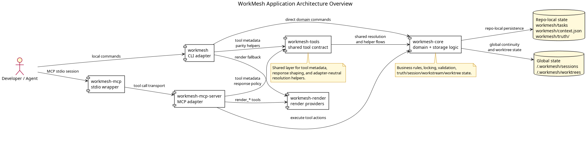
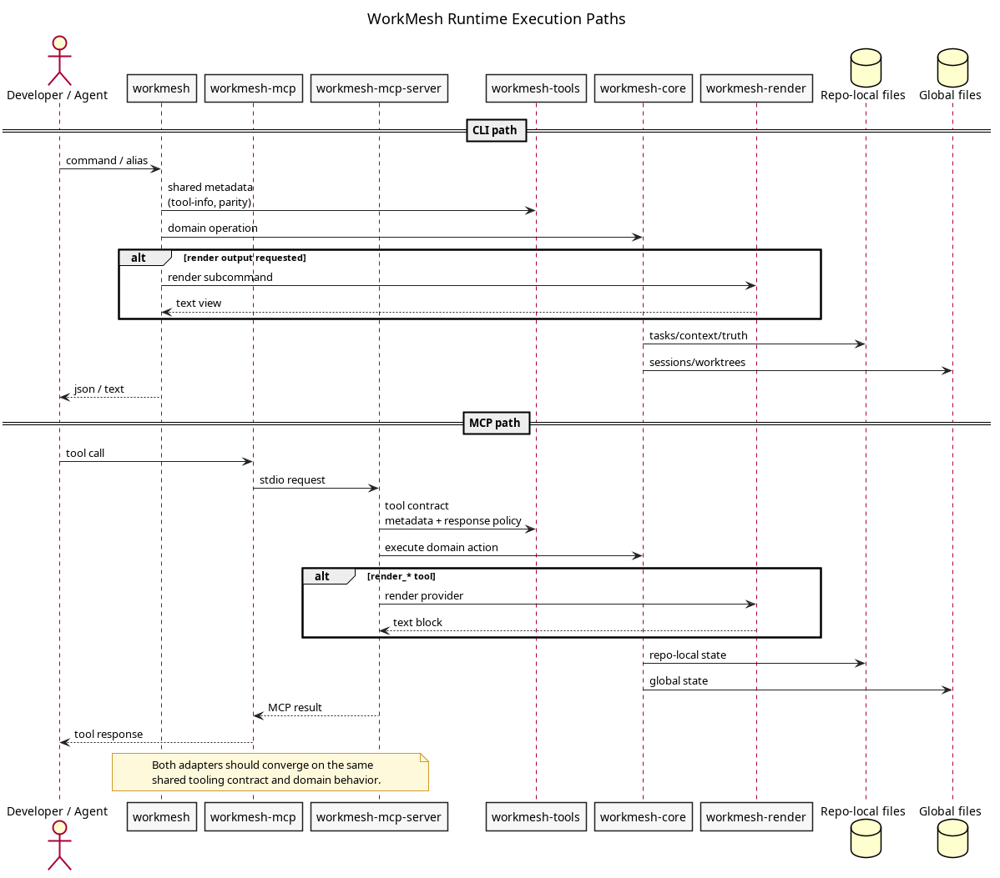
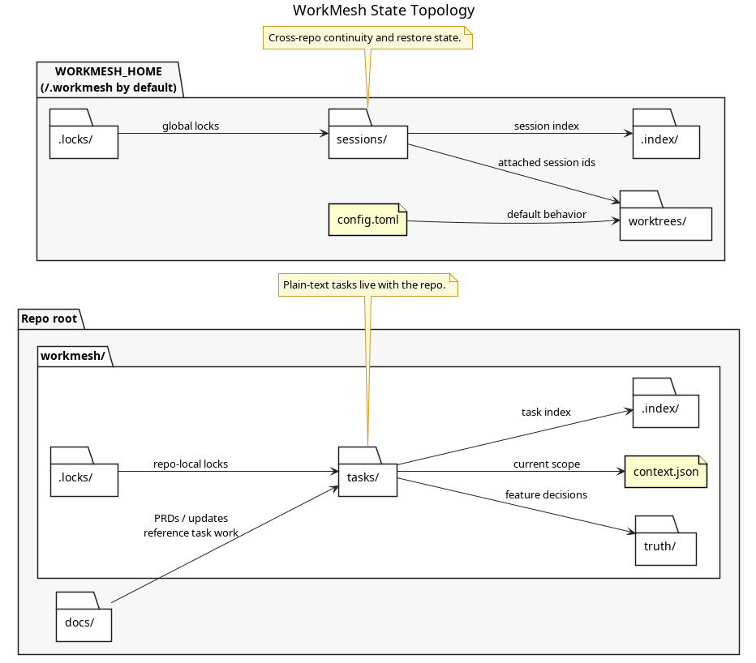

# WorkMesh Architecture

This page documents the current WorkMesh application architecture after the shared-tooling refactor.

The goal is straightforward: a contributor should be able to understand where responsibilities live, how CLI and MCP requests flow through the system, and where WorkMesh persists state without opening the Rust source first.

## 1. Application Overview



What this diagram shows:
- `workmesh` is the CLI adapter.
- `workmesh-mcp` is only the stdio wrapper.
- `workmesh-mcp-server` is the MCP adapter.
- `workmesh-tools` is the shared tool-contract layer used by both adapters.
- `workmesh-core` owns domain logic, storage integrity, and state mutation.
- `workmesh-render` owns human-friendly rendering.

The key architectural rule is that adapters depend on the shared tooling layer and domain layer; they do not depend on each other.

## 2. Runtime Execution Paths



What this diagram shows:
- CLI and MCP requests take different transport paths.
- Both paths should converge on the same shared tooling contract and the same domain behavior.
- Rendering is a provider concern, not a domain concern.
- Repo-local state and global continuity state are written through `workmesh-core`.

## 3. State Topology



What this diagram shows:
- Repo-local state lives under `workmesh/` in the project.
- Global state lives under `WORKMESH_HOME` (`~/.workmesh` by default).
- Locks and indexes are part of the tracked runtime architecture, not incidental implementation details.
- Docs and PRDs sit next to the task system rather than outside it.

## Contributor Guidance

Use this routing rule before changing code:
- shared tool metadata, response-policy helpers, and adapter-neutral resolution belong in `workmesh-tools`
- CLI parsing and presentation belong in `workmesh`
- MCP transport glue belongs in `workmesh-mcp-server`
- domain/storage/state behavior belongs in `workmesh-core`
- rendering belongs in `workmesh-render`

## Regenerating Diagram PNGs

Use the local PlantUML CLI:

```bash
plantuml -tpng docs/diagrams/application-architecture-overview.puml \
  docs/diagrams/application-execution-paths.puml \
  docs/diagrams/application-state-topology.puml
```

The rendered PNG files are the published documentation artifacts. The PlantUML files remain in the repo as the source of truth for regeneration.
